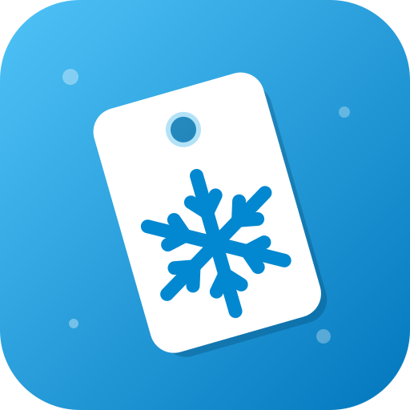
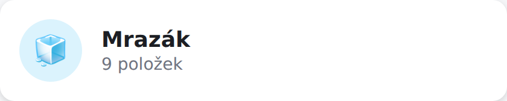
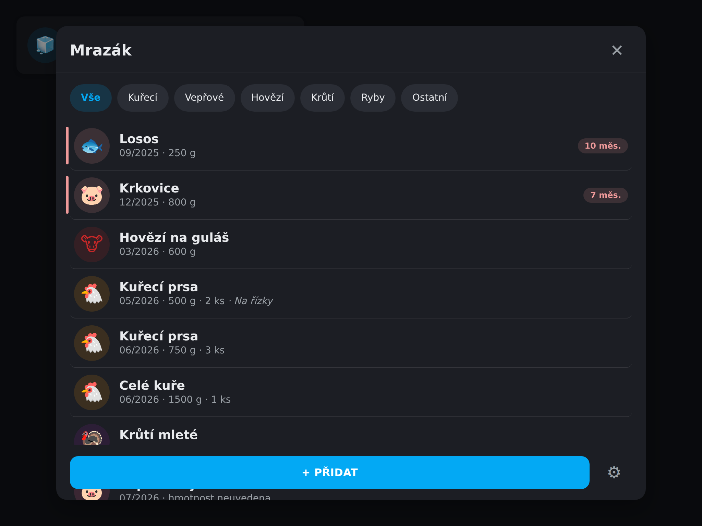
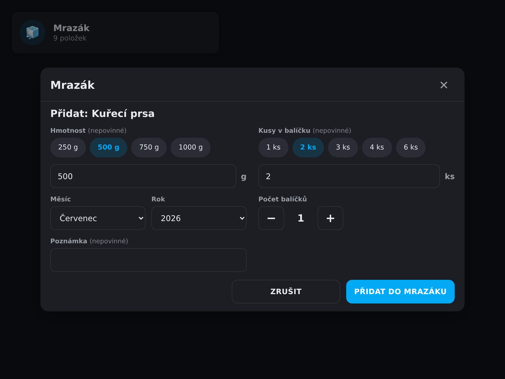
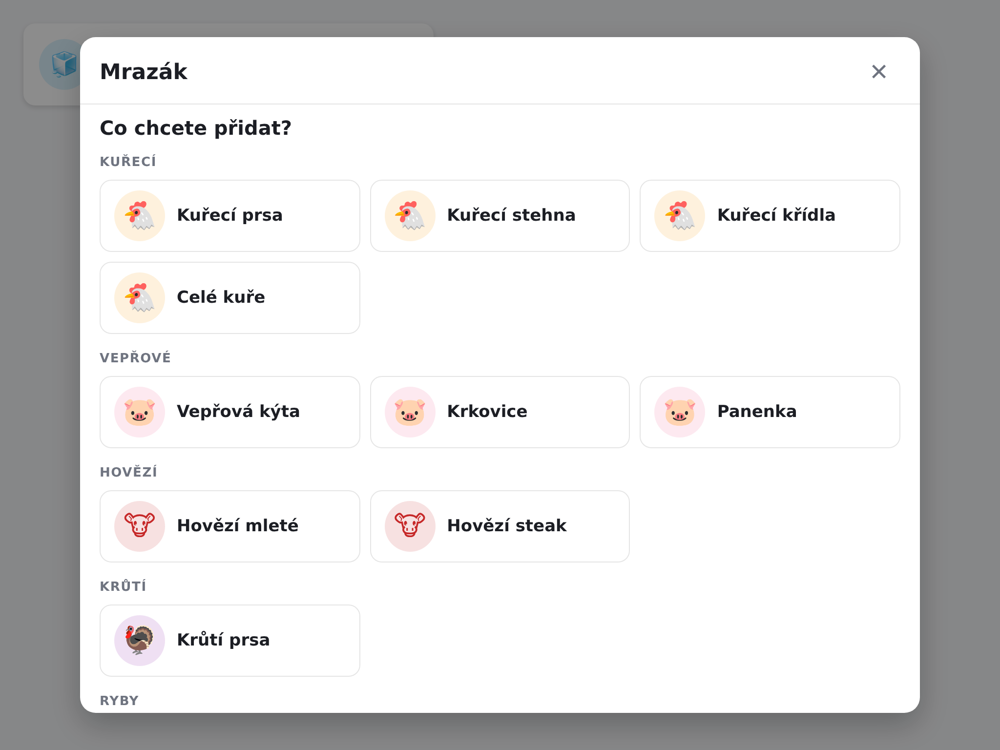
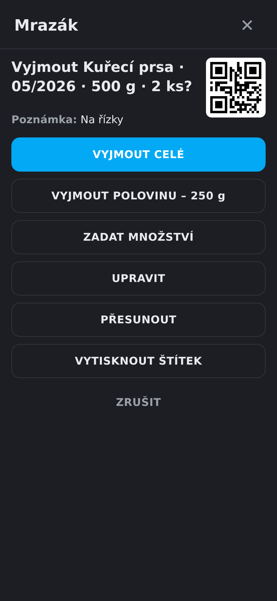
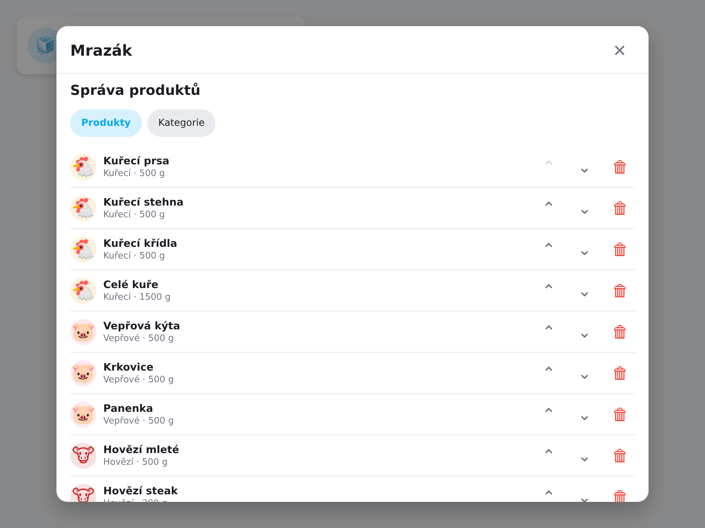
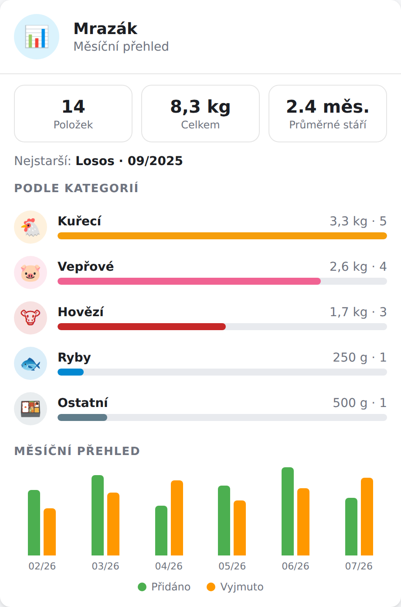

<div align="center">



# Freezer Inventory (Mrazák)

**Evidence každého balíčku v mrazáku, ovládaná z tabletu na lednici.**

[](https://github.com/hacs/integration)
[](https://github.com/nikopol666/homeassistant-freezer-inventory/releases)
[](LICENSE)

[](https://my.home-assistant.io/redirect/hacs_repository/?owner=nikopol666&repository=homeassistant-freezer-inventory&category=integration)
[](https://my.home-assistant.io/redirect/config_flow_start/?domain=freezer_inventory)

🇬🇧 **[English documentation](README.md)**

</div>

---

Vlastní integrace a Lovelace karta pro Home Assistant určená k evidenci jednotlivých balíčků potravin v mrazáku. Navržená primárně pro dotykové ovládání na tabletu na lednici (funguje skvěle ve Fully Kiosk Browseru).

## Funkce

- 📦 **Každý balíček je samostatná položka** — druh, měsíc/rok zamrazení, volitelná hmotnost **a/nebo počet kusů**, poznámka
- 👆 **Dotykové rozhraní** — velké dlaždice, řádky 56–72 px, tabletový režim, vestavěné popupy (žádný Browser Mod / Bubble Card)
- ➕ **Rychlé přidávání** — dlaždice produktů podle kategorií s emoji ikonami, rychlé volby hmotnosti, více balíčků najednou
- ➖ **Chytré vyjímání** — celé / polovina / konkrétní hmotnost nebo počet kusů, s potvrzením a možností **VRÁTIT ZPĚT**
- 🗂️ **Správa předvoleb v UI** — kategorie (barvy, ikony, doby skladování) i produkty (výchozí a rychlé hmotnosti, pořadí, skrývání)
- ⏰ **Zvýraznění starých položek** — podle doporučené doby skladování kategorie, s globálním prahem jako zálohou
- 🚪 **Automatické zavření** — popup se volitelně zavře po nastavené době nečinnosti (ideální pro kiosek)
- 🧊 **Více mrazáků** — správa v možnostech integrace, položky lze mezi mrazáky přesouvat
- 📊 **Statistiky** — karta `display_mode: stats`: aktuální složení podle kategorií a měsíční graf přidáno/vyjmuto, plus senzor celkové hmotnosti pro dlouhodobé grafy v HA
- 🏷️ **QR štítky** — tisk štítků (jednotlivě i hromadně) s QR kódem, naskenováním kamerou se položka rovnou otevře
- 💾 **Export / import** — kompletní export dat a import (sloučit/nahradit) v možnostech integrace
- 💾 **Perzistentní úložiště** — data v `.storage/`, přežijí restart a jsou součástí záloh HA
- 🌍 **Čeština a angličtina** — jazyk se volí v integraci, nezávisle na jazyku Home Assistantu
- 🏪 **Instalace přes HACS z jednoho repozitáře** — karta se do Lovelace registruje automaticky

## Ukázky

**Dlaždice na dashboardu** — kliknutím se otevře popup:



**Seznam mrazáku** s filtry kategorií a zvýrazněním starých položek (tmavý režim):



**Formulář přidání** — dvousloupcový tabletový režim s rychlými volbami hmotnosti a kusů:



**Výběr produktu** podle kategorií (světlý režim):



**Dialog vyjmutí** na mobilu — celé / polovina / vlastní množství:



**Správa předvoleb** — kategorie a produkty:



**Režim statistik** (`display_mode: stats`) — složení podle kategorií a měsíční spotřeba:



## Požadavky

- **Home Assistant 2025.8.0 nebo novější** (HACS to vynucuje přes `hacs.json`)
- Ikony integrace v UI Home Assistantu se zobrazují od HA **2026.3+** (starší verze prostě ikonu nezobrazí)
- **Skenování QR** funguje v libovolném prohlížeči (dekodér je přibalený v kartě), samotná kamera ale vyžaduje přístup k HA přes **HTTPS** (např. Nabu Casa) a povolení kamery — ve Fully Kiosku zapněte *Camera Access*, v companion aplikaci povolte aplikaci kameru

## Instalace

### HACS (doporučeno)

1. Klikněte na **HACS badge výše**, nebo: HACS → ⋮ → *Custom repositories* → přidejte
   `https://github.com/nikopol666/homeassistant-freezer-inventory` (typ **Integration**)
2. Nainstalujte **Freezer Inventory** a restartujte Home Assistant
3. Klikněte na **badge Přidat integraci výše**, nebo: *Nastavení → Zařízení a služby → Přidat integraci → Freezer Inventory*

### Ručně

Zkopírujte `custom_components/freezer_inventory` do `config/custom_components/` a restartujte HA.

## První spuštění

| Volba | Výchozí |
|---|---|
| Jazyk rozhraní | čeština |
| Název mrazáku | Mrazák |
| Vytvořit výchozí produkty | ano |
| Výchozí jednotka | g |

Integrace vytvoří senzor `sensor.mrazak` (stav = počet balíčků, souhrnné atributy) a nabídku ~30 předvolených produktů v 6 kategoriích ve zvoleném jazyce.

## Karta

Přidejte přes vizuální editor (*Freezer Inventory Card*) nebo YAML:

```yaml
type: custom:freezer-inventory-card
freezer_id: main_freezer
display_mode: popup
touch_mode: true
```

Všechny volby:

```yaml
type: custom:freezer-inventory-card
freezer_id: main_freezer
name: Mrazák           # přepíše název
icon: mdi:snowflake    # nebo emoji, např. 🧊
display_mode: popup    # popup | list | stats (statistiky)
touch_mode: true       # větší dotykové prvky
show_count: true
show_weight: true
show_note: true
sort: oldest_first     # oldest_first | newest_first
old_months: 6          # přepíše globální práh zvýraznění
language: cs           # cs | en (výchozí dle integrace)
auto_close: 60         # zavřít popup po N sekundách nečinnosti
label_format: a4       # a4 | 50x30 | 40x30 | 40x12 | 30x15 | libovolné "ŠxV" v mm
label_action: print    # print (systémový tisk) | image (PNG) | niimbot (přímý tisk)
label_printer: ""      # jen niimbot: device_id (potřeba jen při více tiskárnách)
label_font: ""         # jen niimbot: název TTF z www/fonts (kvůli speciálním znakům)
qr_content: id         # id (kompaktní) | link (načte i fotoaparát mobilu)
qr_link_base: ""       # jen link: veřejná adresa dashboardu (výchozí: aktuální stránka)
```

### Skenování nativním fotoaparátem mobilu

Nastavte `qr_content: link` (a ideálně `qr_link_base` na veřejnou HTTPS adresu dashboardu, např. Nabu Casa). Štítky pak nesou URL místo holého ID — naskenování **běžnou aplikací fotoaparátu** otevře dashboard v prohlížeči a karta sama vyskočí s dialogem dané položky. Skener v kartě čte obě varianty QR.

### Štítkové tiskárny (Niimbot apod.)

- `label_action: niimbot` tiskne **přímo z Home Assistantu** přes integraci [hass-niimbot](https://github.com/eigger/hass-niimbot) (Bluetooth): karta zavolá `niimbot.print` s deklarativním payloadem (texty + QR), štítek vykreslí sama tiskárna, ostře. S jednou tiskárnou není potřeba nic dalšího; při více nastavte `label_printer` na device id. Kdyby se česká diakritika tiskla špatně, nahrajte TTF font do `www/fonts/` a nastavte `label_font`.

- `label_format: 50x30` (nebo libovolné `ŠxV` v mm) tiskne **jeden štítek na stránku** přesně v dané velikosti — pro štítkové tiskárny s ovladačem (Brother, Dymo…).
- **Skenování QR** používá nativní BarcodeDetector, kde je k dispozici, a jinde přibalený dekodér — funguje v Chromu, Firefoxu, Safari i companion aplikaci (kamera vyžaduje HTTPS)
- `label_action: image` vygeneruje štítek jako **PNG obrázek** a nabídne sdílení (nebo ho stáhne) — nasdílíte ho rovnou do **aplikace Niimbot** (či jiné aplikace tiskárny) a vytisknete odtud. Tento režim funguje i v mobilní aplikaci Home Assistant.
- Běžný tiskový dialog v companion aplikaci nefunguje (její WebView tisk nepodporuje) — karta to místo tichého selhání rovnou řekne; použijte prohlížeč nebo režim obrázku.

## Hmotnost a kusy

Každá položka může evidovat **hmotnost**, **počet kusů**, obojí, nebo nic:

- *Vyjmout polovinu* půlí vše, co je evidováno (matematické zaokrouhlení, původní hodnoty zůstávají)
- *Zadat množství* umožní vyjmout gramy a/nebo kusy; vyjmutí všeho položku odstraní
- Formulář přidání má navíc pole *počet balíčků*, které vytvoří N samostatných položek najednou

## Služby

`freezer_inventory.add_item` (vrací `item_ids`, podporuje `quantity` i `pieces`), `remove_item`, `remove_half`, `remove_amount` (`amount` v gramech a/nebo `pieces`), `update_item`, `move_item`, `add_product`. Události: `freezer_inventory_item_added` / `_removed` / `_updated`.

```yaml
action: freezer_inventory.add_item
data:
  freezer_id: main_freezer
  product_id: chicken_breast
  month: 7
  year: 2026
  weight: 1200
  pieces: 6
  quantity: 2
  note: Na řízky
```

### Příklad automatizace — upozornění na staré maso

```yaml
automation:
  - alias: "Mrazák: staré položky"
    triggers:
      - trigger: time
        at: "09:00:00"
    conditions:
      - condition: template
        value_template: >
          
          {{ oldest is not none and
             (now().year - oldest.year) * 12 + now().month - oldest.month >= 6 }}
    actions:
      - action: notify.mobile_app_phone
        data:
          title: "🧊 Mrazák"
          message: >
            
            Nejstarší položka: {{ oldest.name }}
            ({{ '%02d' % oldest.month }}/{{ oldest.year }})
```

## Vývoj

```bash
# testy backendu
pip install -r requirements_test.txt
pytest tests/ -v

# build karty (výstup: custom_components/freezer_inventory/frontend/)
npm install
npm run build
```

## Přispívání

Tohle je komunitní projekt — hlášení chyb, nápady, překlady i pull requesty jsou vítané! Viz [CONTRIBUTING.md](CONTRIBUTING.md) a [Code of Conduct](CODE_OF_CONDUCT.md). Pro dotazy a nápady slouží [GitHub Discussions](https://github.com/nikopol666/homeassistant-freezer-inventory/discussions).

## Licence

[MIT](LICENSE)
